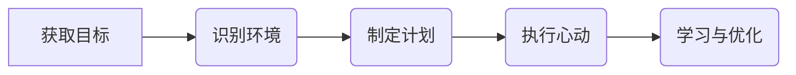

# 智能体构建方法及相关技术

AI 技术应用的本质：是让计算机尽可能多的利用“信息和知识”，业界把应用深度和模式分成 4 个级别：
* L0/一级：LLM/辅助者，直接使用 LLM，不具备工具调用、环境交互和记忆能力，仅使用到（模型）预训练时提供的知识；
* L1/二级：RAG/辅助者+，以 LLM 为中心，通过连接外部知识（搜索引擎、数据库等）获取和处理信息，可使用到外部业务相关的知识；
* L2/三级：AI Agent/执行者，以 LLM 为引擎，通过应用“规划、行动、自我优化和上下文工程信息筛选/管理”等技术手段，实现更广泛的应用场景；
* L3/四级：Agentic AI/管理者，以特定领域的多个专业智能体为基础，通过自主设置目标、预判潜在风险，协同多个执行者完成更高级别的工作任务和目标；
本文将重点讨论 L2/三级 AI Agent/执行者技术体系的构建方法和工具。

## 1. 定义
### 智能体
智能体，是一种能够感知环境、做出决策并自主行动以实现目标的计算实体。与传统软件的区别是具备“自主性、主动性、响应性和目标导向”的特性。
实现该计算实体的关键能力包括工具使用、记忆和通信3个方面。

### 智能体构建工具
智能体构建工具是业界经过实战检验的模版和蓝图，为智能体行为设计与实现中的常见挑战提供产品化解决方案。使用该工具能提升智能体构建的结构性、可维护性、可靠性和效率，避免重复造轮子，并使客户能专注与应用创新。目前流行的智能体构建框架和工具：
  + LangChain / LangGraph
  + Google Agent Developer Kit(ADK)
  + Crew AI / ……

#### 2. AI Agent 特征解析
* AI Agent/智能体遵循 5 步循环来完成目标任务：1️⃣获取目标、2️⃣识别环境、3️⃣制定计划、4️⃣执行行动、5️⃣学习与优化：

#### 3. 核心方法与模式
##### 3.1 Prompt Chaining / 提示链模式
提示链模式也被称为**管道模式/Pipeline Pattern**，其核心目标是将复杂任务拆解成一系列更小、更易于管理的子任务，并为每个子任务精心设计提示词，以此来应对面向复杂问题时单条提示词可能存在的复杂性和巨大挑战。
该技术的关键思想是：拆解复杂性，将上一任务的输出，作为下一步动作的输入并形成*链式*依赖”，这为提示词的编写和管理引入了模块化和清晰性特点，保障了提示词的准确性、针对性，并为集成外部知识和工具创造了水到渠成的扩展点。

……

